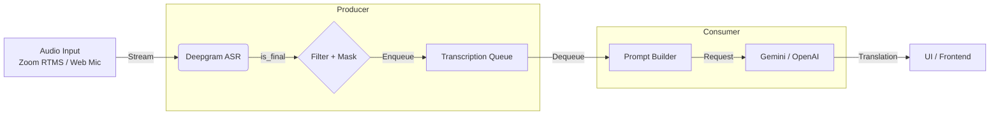

# リアルタイム同時翻訳システム アーキテクチャ設計書

## 1. 概要

本システムは、Zoom RTMSもしくはWebマイク入力をリアルタイムに文字起こしし、
文脈を加味して翻訳し、低遅延で表示するSimulSTパイプラインである。Deepgramによる
低レイテンシASRと、Gemini 3.0 Flash/OpenAIによる文脈指向翻訳を組み合わせる。

## 2. 設計目標

1. **Low Latency:** 非同期パイプラインでブロッキングを排除し、遅延を最小化する。
2. **Context Awareness:** 直近の会話履歴を参照し、断片入力でも高精度に翻訳する。
3. **Operational Simplicity:** 起動時のキャッシュ生成と明確な再生成トリガーで運用を安定化。

## 3. システム構成図 (Data Flow)



## 4. コンポーネント詳細設計

### 4.1 Audio Input

- **Zoom RTMS:** SDKからPCMフレームを取得し、Deepgram WebSocketへ送信。
- **Web Demo:** Gradioのマイク入力を`QueueAudioCapture`へ流し込み、同一パイプラインで処理。

### 4.2 ASR: Deepgram Settings

- **Model:** `nova-2-general` (推奨)
- **Key Parameters:**
  - `smart_format=true`: 句読点・数値整形を有効化し、翻訳精度を向上。
  - `endpointing=500`: 発話終了後500msの無音検知で `is_final` を発行。
  - `utterance_end_ms`: 意味的な発話区切り検知。UtteranceEnd受信時に直近interimを確定。
  - `interim_results=true`: UI向けの体感速度改善に利用するが、翻訳トリガーには使わない。

### 4.3 MT Strategy: Contextual Sliding Window

- **Trigger:** `is_final: true` のみを翻訳対象とする。
- **Prompt Structure:** `<context>` と `<target>` を分離し、文脈と翻訳対象を明示。
- **Sliding Window:**
  - 直近 `N` 文（デフォルト3）をFIFOバッファで保持。
  - 翻訳後にバッファへ現在文を追加する（自己参照を回避）。
- **曖昧語/固有名詞:**
  - 人名・組織名・製品名・地名・略語・コード識別子、または曖昧/未知語は「そのまま残す」。

### 4.4 MT Engine: Gemini 3.0 Flash / OpenAI

- **Gemini (Context Caching必須):**
  - システムプロンプト + 辞書をContext Cacheへ登録。
  - 翻訳リクエストはキャッシュ参照 + `<context>` `<target>` を送信。
  - 辞書更新時はキャッシュを破棄・再生成。
- **Structured Output:**
  - LangChainのStructured Outputで `latest_slide`（最新の翻訳結果）と `kept_terms`
    （固有名詞/曖昧語として保持した語）を返す。
- **OpenAI:**
  - LangChain経由でシステムプロンプトを送信（キャッシュは不要）。

### 4.5 キュー/バックプレッシャー

- 翻訳処理はASR受信ループから独立したConsumerタスクで実行。
- `translation_queue_size` を超過した場合は古い文を破棄し、最新文優先。

## 5. 実装ロジック (Python Asyncio)

```python
async def start():
    await translator.prepare()  # Gemini cache作成
    await transcriber.connect()
    await audio_capture.start()
    tasks = [
        asyncio.create_task(audio_to_transcription()),
        asyncio.create_task(collect_transcriptions()),
        asyncio.create_task(translation_worker()),
    ]

async def collect_transcriptions():
    async for result in transcriber.results():
        if not result.is_final:
            continue
        text = result.text.strip()
        if not text:
            continue
        masked = f"[uncertain: {text}]" if result.is_low_confidence else text
        if queue.full():
            queue.get_nowait()  # drop oldest
        queue.put_nowait((result, masked))

async def translation_worker():
    while True:
        result, masked = await queue.get()
        output = await translator.translate(masked)  # structured output
        emit(result.text, output.latest_slide, output.kept_terms, output.slide_window)
```

## 6. Webデモ (Gradio)

- **入力:** ブラウザのマイク音声（ストリーミング）
- **処理:** `QueueAudioCapture` → `TranslationPipeline`
- **出力:** スライドウィンド（直近N文）の文字起こし/翻訳をリアルタイム表示
- **起動:** `uv run real-time-translation-demo`

## 7. エッジケースと対策

| 事象 | 対策 |
| --- | --- |
| 無音過多 | `endpointing`が効かない場合はタイムアウト監視で手動確定。 |
| 翻訳遅延 | キュー溢れ時は古い文を破棄し、最新を優先する。 |
| 幻覚 | `<context>` `<target>` タグで文脈と翻訳対象を分離する。 |
| 辞書更新 | Context Cacheの再生成を実施し、IDを差し替える。 |

## 8. 今後の拡張性

- **RAG:** 専門用語辞書や会議録のVector検索を導入し、動的に用語注入。
- **Speaker Diarization:** 発話者情報を文脈に含め、口調の一貫性を向上。
- **代替ASR:** Aqua Voice / AssemblyAIの評価・切替を可能にする抽象化。

---

# Zoom → ASR → 翻訳 → WebSocket 字幕 配信構成まとめ

## 目的

Zoom 会議音声をリアルタイムで文字起こしし、翻訳結果を WebSocket 経由で即時配信する。
遅延最小化を最優先。

## 全体アーキテクチャ

```
Zoom
↓ RTMP
Node-Media-Server
↓ PCM (16kHz, mono)
DeepGram ASR (Python)
├─ WebSocket（ASR即時字幕）
└─ HTTP（非同期）
↓
Gemini 翻訳 (Python)
↓
WebSocket（翻訳字幕更新）
```

## コンテナ構成（docker-compose）

- nms  
  RTMP 受信専用。中継のみ。
- deepgram  
  音声を ASR。interim 結果を即時配信。
- gemini  
  翻訳専用。ステートレス API。
- ws  
  字幕配信用。FastAPI + WebSocket。

## docker-compose.yml（最終形）

```yaml
version: "3.9"

services:
  nms:
    image: illuspas/node-media-server:2.7.5
    ports:
      - "1935:1935"
      - "8000:8000"
      - "8443:8443"

  ws:
    build: ./services/ws
    ports:
      - "8000:8000"
    env_file: .env

  gemini:
    build: ./services/translator
    env_file: .env
    environment:
      - WS_PUBLISH_URL=http://ws:8000/publish
    depends_on:
      - ws

  deepgram:
    build: ./services/asr
    env_file: .env
    environment:
      - RTMP_URL=rtmp://nms:1935/live/zoom
      - WS_PUBLISH_URL=http://ws:8000/publish
      - TRANSLATION_API_URL=http://gemini:8000/translate
    depends_on:
      - nms
      - gemini
      - ws
```

## DeepGram ASR（要点）

- ffmpeg 設定
  - low delay
  - 16kHz / linear16 / mono
  - 20–40ms chunk

```bash
ffmpeg -fflags nobuffer -flags low_delay \
 -i rtmp://nms:1935/live/zoom \
 -f s16le -ar 16000 -ac 1 -
```

- DeepGram オプション
  - interim_results = true
  - endpointing = 50ms
  - vad_events = false

## Gemini 翻訳

- FastAPI HTTP API
- ASR と完全並列
- partial 文を短文で翻訳
- 翻訳完了後に字幕を更新送信

## WebSocket 字幕配信

### エンドポイント

```
ws://<host>:8000/ws/caption
```

### メッセージ形式

```json
{
  "type": "asr_partial",
  "text": "こんにちは",
  "ts": 123456
}
```

```json
{
  "type": "translation",
  "src": "こんにちは",
  "translated": "Hello"
}
```

## 遅延最小化の原則

- ASR → 翻訳を直列にしない
- interim 結果を即配信
- 翻訳は後追い更新
- WebSocket は 1 hop
- RTMP バッファを切る

## レイテンシ目安

| 区間          | 遅延        |
| ----------- | --------- |
| RTMP → PCM  | 20–40ms   |
| ASR interim | 80–150ms  |
| WebSocket   | <10ms     |
| 翻訳          | 200–400ms |

## 今後の拡張候補

- WebRTC 化（RTMP 廃止）
- Redis / Kafka による多会議スケール
- 話者分離（diarization）
- Gemini による要約・議事録生成
- 字幕 Web UI（React / Svelte）
